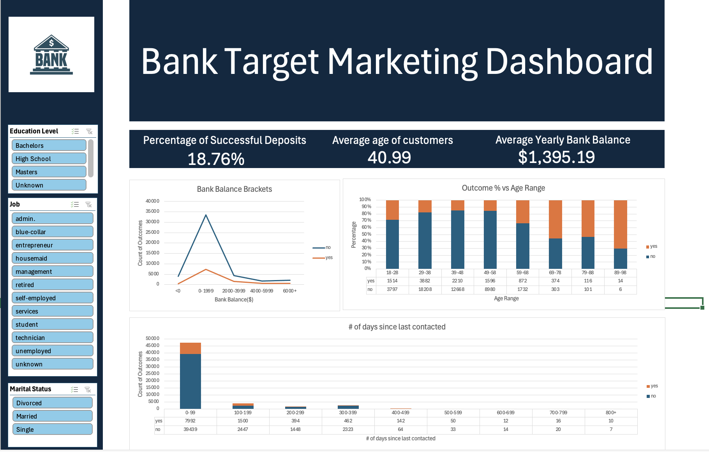
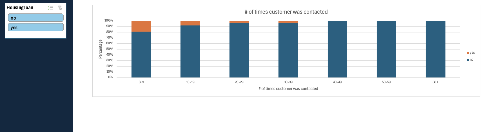

# Bank-Target-Marketing-Dashboard
Analyzing data from a bank's marketing campaign aimed at acquiring more deposits from customers. The dashboard was created with Excel and is available to download in this repository.

## Goal of this analysis
* See see which factors appear to influence customers’ decision to subscribe to term deposits
* By understanding the contributing factors to customer subscription behaviour, the bank can tailor their marketing strategies to improve their chances at acquiring more customers

## Data Acquisition
* The dataset is fictitous and was acquired from kaggle: https://www.kaggle.com/datasets/seanangelonathanael/bank-target-marketing 
