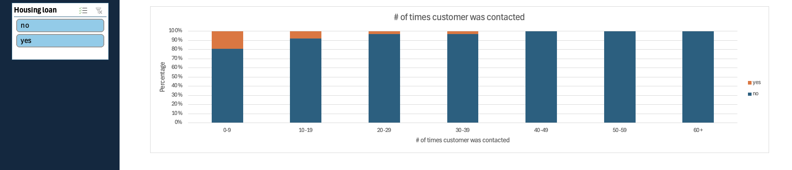

# Bank Target Marketing Dashboard
Analyzing data from a bank's marketing campaign aimed to acquire more customer deposits. The dashboard was created with Excel. To view the dashboard, download the Excel file in this repository.

## Goals of the analysis
* To see which factors influence customers' decision to subscribe to term deposits.
* By understanding the contributing factors to customer subscription behaviour, the bank can tailor their marketing strategies towards a particular segment.

## Data Acquisition
* The dataset is fictitious and was acquired from Kaggle: https://www.kaggle.com/datasets/seanangelonathanael/bank-target-marketing 

## Metrics and Dimensions
* Age Range: Categorized ages of the bank’s customers
* Job: Customer's occupation
* Marital Status: Whether the customer is married, single, or divorced
* Education Level: The amount of schooling completed by the customer. Ranges from high school to master's degree
* Average Yearly Bank Balance: Customer's average yearly balance
* Housing Loan: Whether or not the customer has a mortgage
* Number of Times Customer was contacted: Number of times the customer was contacted during this campaign
* Number of days since last contacted: The number of days a representative contacted the customer since the previous campaign
* Outcome: Whether or not the customer ended up subscribing to a term deposit

## Summary of Insights
* Unfortunately most customers did not end up making a deposit, specifically only 18.76% ended up subscribing.
* However, the highest percentage of successful deposits was amongst students at 41%, followed by retirees at 33.93%.
* Customers contacted less were more likely to make a deposit.
* Education did not seem to significantly impact whether or not a customer would subscribe to a term deposit. The same applies to marital status.
* The existence of a housing loan however did seem to impact a customer's willingness to subscribe. Specifically, those who did not have a mortgage subscribed to a term deposit at twice the rate of those who have a mortgage.

## Recommendation & Next Steps
* For the future, the bank should look to focus its efforts on marketing to students. They seem to be the most eager to make deposits.
* Prospective customers should be contacted less. Otherwise, the person being contacted might feel bothered and harassed.
* Investigations should be done to better understand why customers who do not have a mortgage are more likely to subscribe to a term deposit than ones without one.

